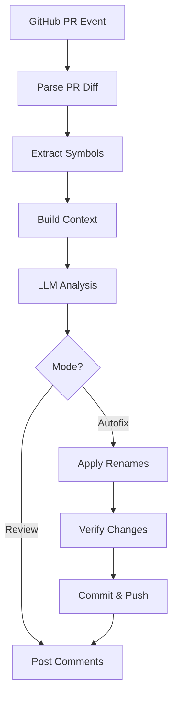

# AI Naming Reviewer - Design Documentation

## 🎯 Overview

The AI Naming Reviewer is a GitHub Action that leverages Large Language Models (LLMs) to analyze code naming conventions in Pull Requests and suggest improvements. It can operate in two modes: review-only (posting comments) and auto-fix (applying safe renames automatically).

## 🏛️ Architecture

### High-Level Flow



### Component Architecture

```
┌─────────────────────────────────────────────────────────┐
│                    GitHub Actions                        │
│  ┌──────────────────┐      ┌──────────────────┐        │
│  │ Review Workflow  │      │ Autofix Workflow │        │
│  └────────┬─────────┘      └────────┬─────────┘        │
└───────────┼────────────────────────┼──────────────────┘
            │                        │
            ▼                        ▼
┌─────────────────────────────────────────────────────────┐
│                   Core Application                       │
│                                                          │
│  ┌──────────────┐  ┌──────────────┐  ┌──────────────┐ │
│  │   Context    │  │     LLM      │  │   Rename     │ │
│  │  Extraction  │→ │  Integration │→ │  Orchestrator│ │
│  └──────────────┘  └──────────────┘  └──────────────┘ │
│         │                  │                  │         │
│         ▼                  ▼                  ▼         │
│  ┌──────────────────────────────────────────────────┐ │
│  │           GitHub API Integration                  │ │
│  └──────────────────────────────────────────────────┘ │
└─────────────────────────────────────────────────────────┘
            │
            ▼
┌─────────────────────────────────────────────────────────┐
│              External Services                           │
│  ┌──────────────┐  ┌──────────────┐  ┌──────────────┐ │
│  │  GitHub API  │  │  OpenAI API  │  │ Language LSPs│ │
│  └──────────────┘  └──────────────┘  └──────────────┘ │
└─────────────────────────────────────────────────────────┘
```

## 📦 Module Details

### 1. Context Extraction (`src/context/`)

**Purpose**: Parse PR diffs and extract rich context about code symbols.

#### diff-parser.ts
- Parses unified diff format from GitHub API
- Detects file language from extension
- Extracts added/modified/deleted lines
- Identifies changed identifiers using regex

**Key Functions**:
```typescript
parseDiff(diffText: string, filePath: string): PRDiff | null
detectLanguage(filePath: string): LanguageType | null
extractIdentifiers(code: string, language: LanguageType): string[]
```

#### symbol-extractor.ts
- Uses language-specific AST parsing (ts-morph for TS/JS)
- Extracts declaration, usages, neighbors, scopes
- Gathers type information
- Falls back to regex for Python/Go

**Key Functions**:
```typescript
extractSymbolInfo(
  filePath: string,
  symbolName: string,
  fileContent: string,
  language: LanguageType
): Promise<SymbolInfo | null>
```

#### context-builder.ts
- Orchestrates diff parsing and symbol extraction
- Filters symbols worth reviewing
- Builds enriched `NamingContext` objects

**Filtering Logic**:
- Skip well-formed names (camelCase, PascalCase, etc.)
- Skip test/mock patterns
- Focus on short, generic, or poorly formatted names

### 2. LLM Integration (`src/llm/`)

**Purpose**: Communicate with OpenAI API to get naming suggestions.

#### prompts.ts
- System prompt defining the AI's role
- Language-specific naming conventions
- User prompt template with context
- Few-shot examples for better results

**Prompt Structure**:
```
System: You are a naming expert...
User: 
  - Language: TypeScript
  - File: src/user.ts
  - Symbol: data
  - Declaration: const data = await fetchUser()
  - Usages: [...]
  - PR Context: "Add user profile caching"
  
  Suggest a better name following TypeScript conventions.
```

#### schema.ts
- Zod schemas for response validation
- JSON parsing with error handling
- Quality checks (confidence, rationale length, etc.)

#### client.ts
- OpenAI API integration
- Retry logic with exponential backoff
- In-memory caching (1 hour TTL)
- Cost tracking

**Caching Strategy**:
- Key: SHA256(file + oldName + declaration)
- TTL: 1 hour
- Reduces duplicate API calls on PR updates

#### config.ts
- Environment variable management
- Model pricing data
- Cost calculation

### 3. Rename Adapters (`src/rename/`)

**Purpose**: Safely rename symbols using language-specific tools.

#### typescript-renamer.ts
- Uses `ts-morph` for AST-based renaming
- Finds all references automatically
- Verifies TypeScript compilation after rename

**Process**:
1. Parse file with ts-morph
2. Find symbol declaration
3. Call `symbol.rename(newName)`
4. Write modified file
5. Verify compilation

#### python-renamer.ts
- Primary: Uses `rope` library via subprocess
- Fallback: Regex-based replacement
- Verifies Python syntax with `py_compile`

#### go-renamer.ts
- Primary: Uses `gopls rename` command
- Fallback: Regex-based replacement
- Verifies compilation with `go build`

#### rename-orchestrator.ts
- Routes to correct language adapter
- Creates backup before rename
- Runs verification after rename
- Rolls back on failure
- Batch processing support

**Safety Checks**:
```typescript
shouldAutoRename(suggestion: NamingSuggestion): boolean {
  return suggestion.confidence >= 0.85 &&
         suggestion.safety.shouldAutofix &&
         !suggestion.safety.isApiSurface;
}
```

### 4. GitHub Integration (`src/github/`)

**Purpose**: Interact with GitHub API for comments and commits.

#### api-client.ts
- Octokit wrapper
- Get PR information
- Post review comments
- Commit changes
- Deduplication logic

#### comment-formatter.ts
- Format suggestions as Markdown
- Generate GitHub Suggested Changes
- Create deduplication hashes
- Summary comments

**Comment Format**:
```markdown
## 🟢 Naming Suggestion (92% confidence)
**Current:** `data`
**Suggested:** `userProfile`
**Rationale:** ...
**Safety:** ...
**Alternatives:** ...
<!-- ai-naming-bot:abc12345 -->
```

#### review.ts
- Entry point for review-only mode
- Posts inline comments
- No code modifications

#### autofix.ts
- Entry point for auto-fix mode
- Security checks (no forks)
- Label verification
- Apply renames
- Commit changes

## 🔐 Security Model

### Fork PR Handling

```typescript
if (isForkPR(pr)) {
  // Review mode: ✅ Safe - only reads code
  // Autofix mode: ❌ Blocked - never execute
}
```

**Rationale**: Fork PRs could contain malicious code. We never execute code from untrusted sources.

### Permission Model

| Workflow | Permissions | Reason |
|----------|-------------|--------|
| Review | `contents: read`, `pull-requests: write` | Read code, post comments |
| Autofix | `contents: write`, `pull-requests: write` | Modify code, commit changes |

### Token Security

- API keys stored in GitHub Secrets
- Never logged or exposed
- Scoped to minimum required permissions

## 💰 Cost Optimization

### Strategies

1. **Caching**: 
   - In-memory cache with 1-hour TTL
   - Keyed by file + symbol + declaration hash
   - Reduces duplicate API calls

2. **Smart Filtering**:
   - Skip well-formed names
   - Skip test/mock patterns
   - Focus on problematic names only

3. **Token Limits**:
   - Configurable max tokens (default: 1000)
   - Truncate long contexts
   - Limit usage examples (max 5)

4. **Model Selection**:
   - Default: `gpt-4o-mini` ($0.15/$0.60 per 1M tokens)
   - Configurable via environment variable

### Cost Breakdown

**Typical PR** (10 files, 20 symbols):
- Symbols reviewed: 20
- Symbols filtered: 15 (well-formed)
- API calls: 5
- Avg tokens per call: 800 (500 prompt + 300 completion)
- Total tokens: 4,000
- Cost: ~$0.003

**Large PR** (50 files, 100 symbols):
- Symbols reviewed: 100
- Symbols filtered: 70
- API calls: 30
- Cache hits: 10
- Actual API calls: 20
- Total tokens: 16,000
- Cost: ~$0.012

## ⚡ Performance

### Optimization Techniques

1. **Parallel Processing**: Process multiple symbols concurrently
2. **Lazy Loading**: Only fetch file content when needed
3. **Incremental Parsing**: Parse only changed files
4. **Early Exit**: Stop on first critical error

### Benchmarks

| PR Size | Files | Symbols | Time | Cost |
|---------|-------|---------|------|------|
| Small | 1-5 | 5-10 | 30s | $0.01 |
| Medium | 5-20 | 10-30 | 60s | $0.03 |
| Large | 20-50 | 30-100 | 120s | $0.05 |

## 🧪 Testing Strategy

### Unit Tests
- Mock external dependencies (GitHub API, OpenAI)
- Test each module independently
- Focus on edge cases

### Integration Tests
- Simulate full PR workflow
- Verify comment format
- Test rename correctness

### Test Coverage Goals
- Lines: 70%+
- Functions: 70%+
- Branches: 70%+

## 🔄 Workflow Triggers

### Review Workflow
```yaml
on:
  pull_request:
    types: [opened, synchronize, reopened, ready_for_review]
  pull_request_target:
    types: [opened, synchronize, reopened, ready_for_review]
```

**Why `pull_request_target`?**
- Allows commenting on fork PRs
- Runs with base repo permissions
- Safe because we only read code, never execute

### Autofix Workflow
```yaml
on:
  pull_request:
    types: [labeled, synchronize]

if: |
  github.event.pull_request.head.repo.full_name == github.repository &&
  contains(github.event.pull_request.labels.*.name, 'auto-naming-fix')
```

**Conditions**:
1. Same-repo PR only (not fork)
2. Has `auto-naming-fix` label
3. Triggered by label add or PR update

## 📊 Metrics & Monitoring

### Tracked Metrics
- API calls per PR
- Total tokens used
- Estimated cost
- Cache hit rate
- Suggestions generated
- Auto-fixes applied
- Verification failures

### Logging Levels
- **DEBUG**: Detailed execution flow
- **INFO**: Key operations (default)
- **WARN**: Non-critical issues
- **ERROR**: Failures requiring attention

## 🚀 Future Enhancements

### Planned Features
1. **Custom Rules**: User-defined naming patterns
2. **Team Conventions**: Learn from existing codebase
3. **Multi-File Refactoring**: Rename across file boundaries
4. **IDE Integration**: VSCode extension
5. **Analytics Dashboard**: Track naming quality over time
6. **More Languages**: Rust, Java, C++, etc.

### Potential Improvements
1. **Streaming Responses**: Reduce latency
2. **Local LLM Support**: Privacy-focused option
3. **Incremental Learning**: Improve suggestions over time
4. **Conflict Resolution**: Handle merge conflicts
5. **Performance Profiling**: Identify bottlenecks

## 📚 References

- [GitHub Actions Documentation](https://docs.github.com/en/actions)
- [OpenAI API Reference](https://platform.openai.com/docs/api-reference)
- [ts-morph Documentation](https://ts-morph.com/)
- [Octokit Documentation](https://octokit.github.io/rest.js/)

---

**Last Updated**: 2024
**Version**: 1.0.0
